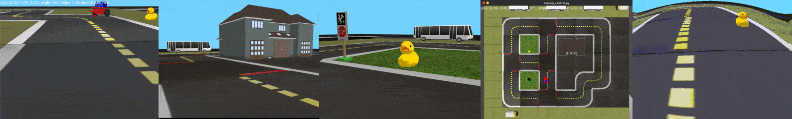
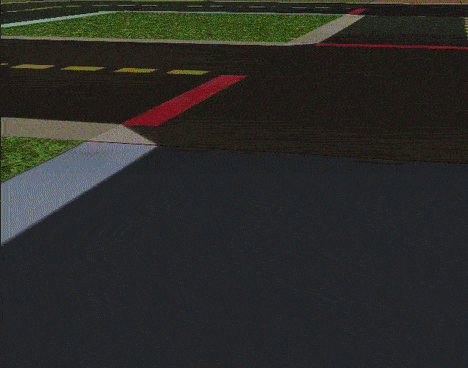
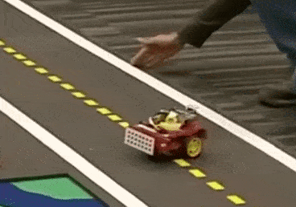
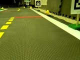

# Gym-Duckietown

[](https://circleci.com/gh/duckietown/gym-duckietown/tree/master) [](https://hub.docker.com/r/duckietown/gym-duckietown)


[Duckietown](http://duckietown.org/) self-driving car simulator environments for OpenAI Gym.

Please use this bibtex if you want to cite this repository in your publications:

```
@misc{gym_duckietown,
  author = {Chevalier-Boisvert, Maxime and Golemo, Florian and Cao, Yanjun and Mehta, Bhairav and Paull, Liam},
  title = {Duckietown Environments for OpenAI Gym},
  year = {2018},
  publisher = {GitHub},
  journal = {GitHub repository},
  howpublished = {\url{https://github.com/duckietown/gym-duckietown}},
}
```

This simulator was created as part of work done at [Mila](https://mila.quebec/).

<p align="center">
<br>
</p>

<h2 align="center">
Welcome to <b>Duckietown</b>! 
</h2>

## Table of Contents


1. [Gym-Duckietown](#Gym-Duckietown)
   1. [Introduction](#Introduction)
   2. [Installation](#Installation)
      1. [Installation Using Conda (Alternative Method)](#Installation-Using-Conda-Alternative-Method)
   3. [Usage](#Usage)
      1. [Testing](#Testing)
      2. [Learning](#Learning)
   4. [Design](#Design)
      1. [Map File Format](#Map-File-Format)
      2. [Observations](#Observations)
      3. [Actions](#Actions)
      4. [Reward Function](#Reward-Function)
   5. [Troubleshooting](#Troubleshooting)
      1. [ImportError: Library "GLU" not found](#ImportError-Library-GLU-not-found)
      2. [NoSuchDisplayException: Cannot connect to "None"](#NoSuchDisplayException-Cannot-connect-to-None)
      3. [Running headless](#Running-headless)
      4. [Running headless and training in a cloud based environment (AWS)](#Running-headless-and-training-in-a-cloud-based-environment-AWS)
      5. [Poor performance, low frame rate](#Poor-performance-low-frame-rate)
      6. [RL training doesn't converge](#RL-training-doesnt-converge)
      7. [Unknown encoder 'libx264' when using gym.wrappers.Monitor](#Unknown-encoder-libx264-when-using-gymwrappersMonitor)

Thanks @na018 for contributing this!

## Introduction

Gym-Duckietown is a simulator for the [Duckietown](https://duckietown.org) Universe, written in pure Python/OpenGL (Pyglet). It places your agent, a Duckiebot, inside of an instance of a Duckietown: a loop of roads with turns, intersections, obstacles, Duckie pedestrians, and other Duckiebots. It can be a pretty hectic place!

Gym-Duckietown is fast, open, and incredibly customizable. What started as a lane-following simulator has evolved into a fully-functioning autonomous driving simulator that you can use to train and test your Machine Learning, Reinforcement Learning, Imitation Learning, or even classical robotics algorithms. Gym-Duckietown offers a wide range of tasks, from simple lane-following to full city navigation with dynamic obstacles. Gym-Duckietown also ships with features, wrappers, and tools that can help you bring your algorithms to the real robot, including [domain-randomization](https://blog.openai.com/spam-detection-in-the-physical-world/), accurate camera distortion, and differential-drive physics (and most importantly, realistic waddling).

<p align="center">
<br>
</p>

There are multiple registered gym environments, each corresponding to a different [map file](https://github.com/duckietown/gym-duckietown/tree/master/gym_duckietown/maps):
- `Duckietown-straight_road-v0`
- `Duckietown-4way-v0`
- `Duckietown-udem1-v0`
- `Duckietown-small_loop-v0`
- `Duckietown-small_loop_cw-v0`
- `Duckietown-zigzag_dists-v0`
- `Duckietown-loop_obstacles-v0` (static obstacles in the road)
- `Duckietown-loop_pedestrians-v0` (moving obstacles in the road)

The `MultiMap-v0` environment is essentially a [wrapper](https://github.com/duckietown/gym-duckietown/blob/master/gym_duckietown/envs/multimap_env.py) for the simulator which
will automatically cycle through all available [map files](https://github.com/duckietown/gym-duckietown/tree/master/gym_duckietown/maps). This makes it possible to train on
a variety of different maps at the same time, with the idea that training on a variety of
different scenarios will make for a more robust policy/model.

`gym-duckietown` is an _accompanying_ simulator to real Duckiebots, which allow you to run your code on the real robot. We provide a domain randomization API, which can help you transfer your trained policies from simulation to real world. Without using a domain transfer method, your learned models will likely overfit to various aspects of the simulator, which won't transfer to the real world. When you deploy, you and your Duckiebot will be running around in circles trying to figure out what's going on. 

<p align="center">
<br>
</p>

The `Duckiebot-v0` environment is meant to connect to software running on
a real Duckiebot and remotely control the robot. It is a tool to test that policies
trained in simulation can transfer to the real robot. If you want to
control your robot remotely with the `Duckiebot-v0` environment, you will need to
install the software found in the [duck-remote-iface](https://github.com/maximecb/duck-remote-iface)
repository on your Duckiebot.

<p align="center">
<br>
Duckiebot-v0
</p>

## Installation

Requirements:
- Python 3.6+
- OpenAI gym
- NumPy
- Pyglet
- PyYAML
- cloudpickle
- pygeometry
- dataclasses (if using Python3.6)
- PyTorch or Tensorflow (to use the scripts in `learning/`)

You can install all the dependencies except PyTorch with `pip3`:

```
git clone https://github.com/duckietown/gym-duckietown.git
cd gym-duckietown
pip3 install -e .
```

### Installation Using Conda (Alternative Method)

Alternatively, you can install all the dependencies, including PyTorch, using Conda as follows. For those trying to use this package on MILA machines, this is the way to go:

```
git clone https://github.com/duckietown/gym-duckietown.git
cd gym-duckietown
conda env create -f environment.yaml
```

Please note that if you use Conda to install this package instead of pip, you will need to activate your Conda environment and add the package to your Python path before you can use it:

```
source activate gym-duckietown
export PYTHONPATH="${PYTHONPATH}:`pwd`"
```

## Usage

```
import gym, gym_duckietown # registers the envs!
DUCKIETOWN = ['Duckietown-straight_road-v0','Duckietown-4way-v0','Duckietown-udem1-v0','Duckietown-small_loop-v0','Duckietown-small_loop_cw-v0','Duckietown-zigzag_dists-v0','Duckietown-loop_obstacles-v0','Duckietown-loop_pedestrians-v0']
for town in DUCKIETOWN:
  env = gym.make(town)
  print(town, env.observation_space, env.action_space)
```

### Testing

There is a simple UI application which allows you to control the simulation or real robot manually. The `manual_control.py` application will launch the Gym environment, display camera images and send actions (keyboard commands) back to the simulator or robot. You can specify which map file to load with the `--map-name` argument:

```
./manual_control.py --env-name Duckietown-udem1-v0
```

There is also a script to run automated tests (`run_tests.py`) and a script to gather performance metrics (`benchmark.py`).

### Learning

`gym-duckietown` provides starter code for both reinforcement learning (Pytorch only) and imitation learning (both Tensorflow and Pytorch). In the following section, we describe how to get started, as well as some tips on improving both agents.

Within the `learning/` subdirectory, you will find `imitation/{tensorflow|pytorch}` and `reinforcement/pytorch`. To use either, you will want to change directories into the `learning/` directory, and call scripts from there (this allows us to import utility functions used in all three baselines while not forcing users to install both Tensorflow and Pytorch).

**Pytorch Reinforcement Learning** can be run using: 

```
python -m reinforcement.pytorch.train_reinforcement
```

whereas both **Tensorflow and Pytorch Imitation Learning** can be run using:

```
python -m imitation.{tensorflow|pytorch}.train_imitation
```

We use `argparse` for hyperparameters, which can be found at the bottom of the training files.

Within the `learning/utils` folder, you will find useful wrappers (`wrappers.py`), imitation learning teachers (`teacher.py`), and environment launchers (`env.py`). You can use the `utils` folder to organize helper code that can be used across all baselines, by importing as follows:

```
from utils.{your_file} import {your_class | your function}
```

Since `gym-duckietown` is heavily used in the [AI Driving Olympics](https://challenges.duckietown.org), we encourage you to take a look at some of the [tips and tricks we provide](https://docs.duckietown.org/DT19/AIDO/out/embodied_rl.html) on improving your policy and Sim2Real Transfer.

In addition, although not directly supported in this simulator, we encourage you to check out the [Duckietown Logs](http://logs.duckietown.org/) infrastructure, which has been incredibly successful in [training imitation learning policies](https://github.com/duckietown/challenge-aido_LF-baseline-IL-logs-tensorflow/) or even "warm-starting" reinforcement learning policies.

## Design

### Map File Format

The simulator supports a YAML-based file format which is designed to be easy to hand edit. See the [maps subdirectory](https://github.com/duckietown/gym-duckietown/blob/master/gym_duckietown/maps) for examples. Each map file has two main sections: a two-dimensional array of tiles, and a listing of objects to be placed around the map. The tiles are based on the [Duckietown appearance specification](http://docs.duckietown.org/DT18/opmanual_duckietown/out/duckietown_specs.html).

The available tile types are:
- empty
- straight
- curve_left
- curve_right
- 3way_left (3-way intersection)
- 3way_right
- 4way (4-way intersection)
- asphalt
- grass
- floor (office floor)

The available object types are:
- barrier
- cone (traffic cone)
- duckie
- duckiebot (model of a Duckietown robot)
- tree
- house
- truck (delivery-style truck)
- bus
- building (multi-floor building)
- sign_stop, sign_T_intersect, sign_yield, etc. (see [meshes subdirectory](https://github.com/duckietown/gym-duckietown/blob/master/gym_duckietown/meshes))

Although the environment is rendered in 3D, the map is essentially two-dimensional. As such, objects coordinates are specified along two axes. The coordinates are rescaled based on the tile size, such that coordinates [0.5, 1.5] would mean middle of the first column of tiles, middle of the second row. Objects can have an `optional` flag set, which means that they randomly may or may not appear during training, as a form of domain randomization.

### Observations

The observations are single camera images, as numpy arrays of size (120, 160, 3). These arrays contain unsigned 8-bit integer values in the [0, 255] range.
This image size was chosen because it is exactly one quarter of the 640x480 image resolution provided by the camera, which makes it fast and easy to scale down
the images. The choice of 8-bit integer values over floating-point values was made because the resulting images are smaller if stored on disk and faster to send over a networked connection.

### Actions

The simulator uses continuous actions by default. Actions passed to the `step()` function should be numpy arrays containining two numbers between -1 and 1. These two numbers correspond to forward velocity, and a steering angle, respectively. A positive velocity makes the robot go forward, and a positive steering angle makes the robot turn left. There is also a [Gym wrapper class](https://github.com/duckietown/gym-duckietown/blob/master/gym_duckietown/wrappers.py) named `DiscreteWrapper` which allows you to use discrete actions (turn left, move forward, turn right) instead of continuous actions if you prefer.

### Reward Function

The default reward function tries to encourage the agent to drive forward along the right lane in each tile. Each tile has an associated bezier curve defining the path the agent is expected to follow. The agent is rewarded for being as close to the curve as possible, and also for facing the same direction as the curve's tangent. The episode is terminated if the agent gets too far outside of a drivable tile, or if the `max_steps` parameter is exceeded. See the `step` function in [this source file](https://github.com/duckietown/gym-duckietown/blob/master/gym_duckietown/envs/simplesim_env.py).

## Troubleshooting

If you run into problems of any kind, don't hesitate to [open an issue](https://github.com/duckietown/gym-duckietown/issues) on this repository. It's quite possible that you've run into some bug we aren't aware of. Please make sure to give some details about your system configuration (ie: PC or Max, operating system), and to paste the command you used to run the simulator, as well as the complete error message that was produced, if any.

### ImportError: Library "GLU" not found

You may need to manually install packaged needed by Pyglet or OpenAI Gym on your system. The command you need to use will vary depending which OS you are running. For example, to install the glut package on Ubuntu:

```
sudo apt-get install freeglut3-dev
```

And on Fedora:

```
sudo dnf install freeglut-devel
```

### NoSuchDisplayException: Cannot connect to "None"

If you are connected through SSH, or running the simulator in a Docker image, you will need to use xvfb to create a virtual display in order to run the simulator. See the "Running Headless" subsection below.

### Running headless

The simulator uses the OpenGL API to produce graphics. This requires an X11 display to be running, which can be problematic if you are trying to run training code through on SSH, or on a cluster. You can create a virtual display using [Xvfb](https://en.wikipedia.org/wiki/Xvfb). The instructions shown below illustrate this. Note, however, that these instructions are specific to MILA, look further down for instructions on an Ubuntu box:

```
# Reserve a Debian 9 machine with 12GB ram, 2 cores and a GPU on the cluster
sinter --reservation=res_stretch --mem=12000 -c2 --gres=gpu

# Activate the gym-duckietown Conda environment
source activate gym-duckietown

cd gym-duckietown

# Add the gym_duckietown package to your Python path
export PYTHONPATH="${PYTHONPATH}:`pwd`"

# Load the GLX library
# This has to be done before starting Xvfb
export LD_LIBRARY_PATH=/Tmp/glx:$LD_LIBRARY_PATH

# Create a virtual display with OpenGL support
Xvfb :$SLURM_JOB_ID -screen 0 1024x768x24 -ac +extension GLX +render -noreset &> xvfb.log &
export DISPLAY=:$SLURM_JOB_ID

# You are now ready to train
```

### Running headless and training in a cloud based environment (AWS)

We recommend using the Ubuntu-based [Deep Learning AMI](https://aws.amazon.com/marketplace/pp/B077GCH38C) to provision your server which comes with all the deep learning libraries.

```
# Install xvfb
sudo apt-get install xvfb mesa-utils -y

# Remove the nvidia display drivers (this doesn't remove the CUDA drivers)
# This is necessary as nvidia display doesn't play well with xvfb
sudo nvidia-uninstall -y

# Sanity check to make sure you still have CUDA driver and its version
nvcc --version

# Start xvfb
Xvfb :1 -screen 0 1024x768x24 -ac +extension GLX +render -noreset &> xvfb.log &

# Export your display id
export DISPLAY=:1

# Check if your display settings are valid
glxinfo

# You are now ready to train
```

### Poor performance, low frame rate

It's possible to improve the performance of the simulator by disabling Pyglet error-checking code. Export this environment variable before running the simulator:

```
export PYGLET_DEBUG_GL=True
```

### RL training doesn't converge

Reinforcement learning algorithms are extremely sensitive to hyperparameters. Choosing the
wrong set of parameters could prevent convergence completely, or lead to unstable performance over
training. You will likely want to experiment. A learning rate that is too low can lead to no
learning happening. A learning rate that is too high can lead unstable performance throughout
training or a suboptimal result.

The reward values are currently rescaled into the [0,1] range, because the RL code in
`pytorch_rl` doesn't do reward clipping, and deals poorly with large reward values. Also
note that changing the reward function might mean you also have to retune your choice
of hyperparameters.

### Unknown encoder 'libx264' when using gym.wrappers.Monitor

It is possible to use `gym.wrappers.Monitor` to record videos of the agent performing a task. See [examples here](https://www.programcreek.com/python/example/100947/gym.wrappers.Monitor).

The libx264 error is due to a problem with the way ffmpeg is installed on some linux distributions. One possible way to circumvent this is to reinstall ffmpeg using conda:

```
conda install -c conda-forge ffmpeg
```

Alternatively, screencasting programs such as [Kazam](https://launchpad.net/kazam) can be used to record the graphical output of a single window.
