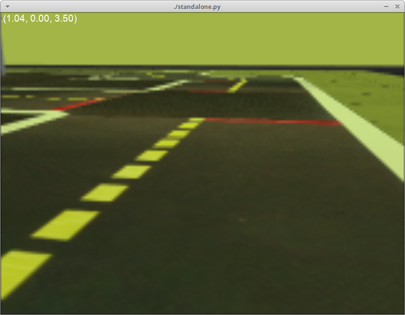

# Gym-Duckietown

[](https://circleci.com/gh/duckietown/gym-duckietown/tree/master)

[Duckietown](http://duckietown.org/) self-driving car simulator environments for OpenAI Gym.

Please use this bibtex if you want to cite this repository in your publications:

```
@misc{gym_duckietown,
  author = {Maxime Chevalier-Boisvert, Florian Golemo, Yanjun Cao, Bhairav Mehta, Liam Paull},
  title = {Duckietown Environments for OpenAI Gym},
  year = {2018},
  publisher = {GitHub},
  journal = {GitHub repository},
  howpublished = {\url{https://github.com/duckietown/gym-duckietown}},
}
```

This simulator was created as part of work done at the [MILA](https://mila.quebec/).

## Introduction

This repository contains three gym environments: `SimpleSim-v0`, `Duckiebot-v0` and `MultiMap-v0`.

<p align="center">
<br>
SimpleSim-v0
</p>

The `SimpleSim-v0` environment is a simple lane-following simulator
written in Python/OpenGL (Pyglet). It draws a loop of road with left and right turns,
along with objects in the background. It implements various forms of
[domain-randomization](https://blog.openai.com/spam-detection-in-the-physical-world/)
and basic differential-drive physics (without acceleration).

<p align="center">
<br>
Duckiebot-v0
</p>

The `Duckiebot-v0` environment is meant to connect to software running on
a real Duckiebot and remotely control the robot. It is a tool to test that policies
trained in simulation can transfer to the real robot. If you want to
control your robot remotely with the `Duckiebot-v0` environment, you will need to
install the software found in the [duck-remote-iface](https://github.com/maximecb/duck-remote-iface)
repository on your Duckiebot.

The `MultiMap-v0` environment is essentially a [wrapper](https://github.com/duckietown/gym-duckietown/blob/master/gym_duckietown/envs/multimap_env.py) for `SimpleSim-v0` which
will automatically cycle through all available [map files](https://github.com/duckietown/gym-duckietown/tree/master/gym_duckietown/maps). This makes it possible to train on
a variety of different maps at the same time, with the idea that training on a variety of
different scenarios will make for a more robust policy/model.

## Installation

Requirements:
- Python 3.5+
- OpenAI gym
- NumPy
- SciPy
- Pyglet
- PyYAML
- PyTorch

You can install all the dependencies except PyTorch with `pip3`:

```
git clone https://github.com/duckietown/gym-duckietown.git
cd gym-duckietown
pip3 install -e .
```

Reinforcement learning code forked from [this repository](https://github.com/ikostrikov/pytorch-a2c-ppo-acktr)
is included under [/pytorch_rl](/pytorch_rl). If you wish to use this code, you
should install [PyTorch](http://pytorch.org/) as follows:

```
conda install pytorch torchvision -c pytorch
```

### Installation Using Conda (Alternative Method)

Alternatively, you can install all the dependencies, including PyTorch, using Conda as follows. For those trying to use this package on MILA machines, this is the way to go:

```
git clone https://github.com/duckietown/gym-duckietown.git
cd gym-duckietown
conda env create -f environment.yaml
```

Please note that if you use Conda to install this package instead of pip, you will need to activate your Conda environment and add the package to your Python path before you can use it:

```
source activate gym-duckietown
export PYTHONPATH="${PYTHONPATH}:`pwd`"
```

### Docker Image

There is a pre-built Docker image available [on Docker Hub](https://hub.docker.com/r/maximecb/gym-duckietown/), which also contains an installation of PyTorch. Alternatively, you can also build an image from the latest version of this repository as follows:

```
sudo docker build --file ./docker/standalone/Dockerfile --no-cache=true --network=host --tag gym-duckietown .
```

Note that in order to get GPU acceleration, you should install and use [nvidia-docker](https://github.com/NVIDIA/nvidia-docker).

## Usage

### Testing

There is a simple UI application which allows you to control the simulation or real robot manually:

```
./manual_control.py --env-name SimpleSim-v0
```

The `manual_control.py` application will launch the Gym environment, display camera images and send actions (keyboard commands) back to the simulator or robot. You can specify which map file to load with the `--map-name` argument:

```
./manual_control.py --env-name SimpleSim-v0 --map-name small_loop
```

There is also a script to run automated tests (`run_tests.py`) and a script to gather performance metrics (`benchmark.py`).

### Reinforcement Learning

To train a reinforcement learning agent, you can use the code provided under [/pytorch_rl](/pytorch_rl). I recommend using the A2C or ACKTR algorithms. A sample command to launch training is:

```
python3 pytorch_rl/main.py --no-vis --env-name Duckie-SimpleSim-Discrete-v0 --algo a2c --lr 0.0002 --max-grad-norm 0.5 --num-steps 20
```

Then, to visualize the results of training, you can run the following command. Note that you can do this while the training process is still running. Also note that if you are running this through SSH, you will need to enable X forwarding to get a display:

```
python3 pytorch_rl/enjoy.py --env-name Duckie-SimpleSim-Discrete-v0 --num-stack 1 --load-dir trained_models/a2c
```

### Imitation Learning

There is a script in the `experiments` directory which automatically generates a dataset of synthetic demonstrations. It uses hillclimbing to optimize the reward obtained, and outputs a JSON file:

```
experiments/gen_demos.py --map-name loop_obstacles
```

Then you can start training an imitation learning model (conv net) with:

```
experiments/train_imitation.py --map-name loop_obstacles
```

Finally, you can visualize what the trained model is doing with:

```
experiments/control_imitation.py --map-name loop_obstacles
```

Note that it is possible to have `gen_demos.py` and `train_imitate.py` running simultaneously, so that training takes place while new demonstrations are being generated. You can also run `control_imitate.py` periodically during training to check on learning progress.

## Design

### Map File Format

The simulator supports a YAML-based file format which is designed to be easy to hand edit. See the [maps subdirectory](https://github.com/duckietown/gym-duckietown/blob/master/gym_duckietown/maps) for examples. Each map file has two main sections: a two-dimensional array of tiles, and a listing of objects to be placed around the map. The tiles are based on the [Duckietown appearance specification](https://docs.duckietown.org/opmanual_duckietown/out/duckietown_specs.html).

The available tile types are:
- empty
- straight
- curve_left
- curve_right
- 3way_left (3-way intersection)
- 3way_right
- 4way (4-way intersection)
- asphalt
- grass
- floor (office floor)

The available object types are:
- barrier
- cone (traffic cone)
- duckie
- duckiebot (model of a Duckietown robot)
- tree
- house
- truck (delivery-style truck)
- bus
- building (multi-floor building)
- sign_blank (a blank sign post)

Although the environment is rendered in 3D, the map is essentially two-dimensional. As such, objects coordinates are specified along two axes. The coordinates are rescaled based on the tile size, such that coordinates [0.5, 1.5] would mean middle of the first column of tiles, middle of the second row. Objects can have an `optional` flag set, which means that they randomly may or may not appear during training, as a form of domain randomization.

In the future, we will add support for more sign objects matching the [Duckietown appearance specification](https://docs.duckietown.org/opmanual_duckietown/out/duckietown_specs.html).

### Observations

The observations are single camera images, as numpy arrays of size (120, 160, 3). These arrays contain unsigned 8-bit integer values in the [0, 255] range.
This image size was chosen because it is exactly one quarter of the 640x480 image resolution provided by the camera, which makes it fast and easy to scale down
the images. The choice of 8-bit integer values over floating-point values was made because the resulting images are smaller if stored on disk and faster to send over a networked connection.

### Actions

The Duckiebot is a differential drive robot. Actions passed to the `step()` function should be numpy arrays containining two numbers between -1 and 1. These two numbers correspond to velocities for the left and right wheel motors of the robot, respectively. There is also a [Gym wrapper class](https://github.com/duckietown/gym-duckietown/blob/master/gym_duckietown/wrappers.py#L42) named `DiscreteWrapper` which allows you to use discrete actions (turn left, move forward, turn right) instead of continuous actions if you prefer.

### Reward Function

The default reward function tries to encourage the agent to drive forward along the right lane in each tile. Each tile has an associated bezier curve defining the path the agent is expected to follow. The agent is rewarded for being as close to the curve as possible, and also for facing the same direction as the curve's tangent. The episode is terminated if the agent gets too far outside of a drivable tile, or if the `max_steps` parameter is exceeded. See the `step` function in [this source file](https://github.com/duckietown/gym-duckietown/blob/master/gym_duckietown/envs/simplesim_env.py).

## Troubleshooting

If you run into problems of any kind, don't hesitate to [open an issue](https://github.com/duckietown/gym-duckietown/issues) on this repository. It's quite possible that you've run into some bug we aren't aware of. Please make sure to give some details about your system configuration (ie: PC or Max, operating system), and to paste the command you used to run the simulator, as well as the complete error message that was produced, if any.

### ImportError: Library "GLU" not found

You may need to manually install packaged needed by Pyglet or OpenAI Gym on your system. The command you need to use will vary depending which OS you are running. For example, to install the glut package on Ubuntu:

```
sudo apt-get install freeglut3-dev
```

And on Fedora:

```
sudo dnf install freeglut-devel
```

### NoSuchDisplayException: Cannot connect to "None"

If you are connected through SSH, or running the simulator in a Docker image, you will need to use xvfb to create a virtual display in order to run the simulator. See the "Running Headless" subsection below.

### Running headless

The simulator uses the OpenGL API to produce graphics. This requires an X11 display to be running, which can be problematic if you are trying to run training code through on SSH, or on a cluster. You can create a virtual display using [Xvfb](https://en.wikipedia.org/wiki/Xvfb). The instructions shown below illustrate this. Note, however, that these instructions are specific to MILA, look further down for instructions on an Ubuntu box:

```
# Reserve a Debian 9 machine with 12GB ram, 2 cores and a GPU on the cluster
sinter --reservation=res_stretch --mem=12000 -c2 --gres=gpu

# Activate the gym-duckietown Conda environment
source activate gym-duckietown

cd gym-duckietown

# Add the gym_duckietown package to your Python path
export PYTHONPATH="${PYTHONPATH}:`pwd`"

# Load the GLX library
# This has to be done before starting Xvfb
export LD_LIBRARY_PATH=/Tmp/glx:$LD_LIBRARY_PATH

# Create a virtual display with OpenGL support
Xvfb :$SLURM_JOB_ID -screen 0 1024x768x24 -ac +extension GLX +render -noreset &> xvfb.log &
export DISPLAY=:$SLURM_JOB_ID

# You are now ready to train
```

### Running headless and training in a cloud based environment (AWS)

We recommend using the Ubuntu-based [Deep Learning AMI](https://aws.amazon.com/marketplace/pp/B077GCH38C) to provision your server which comes with all the deep learning libraries.

```
# Install xvfb
sudo apt-get install xvfb mesa-utils -y

# Remove the nvidia display drivers (this doesn't remove the CUDA drivers)
# This is necessary as nvidia display doesn't play well with xvfb
sudo nvidia-uninstall -y

# Sanity check to make sure you still have CUDA driver and its version
nvcc --version

# Start xvfb
Xvfb :1 -screen 0 1024x768x24 -ac +extension GLX +render -noreset &> xvfb.log &

# Export your display id
export DISPLAY=:1

# Check if your display settings are valid
glxinfo

# You are now ready to train
```

### Poor performance, low frame rate

It's possible to improve the performance of the simulator by disabling Pyglet error-checking code. Export this environment variable before running the simulator:

```
export PYGLET_DEBUG_GL=True
```

### RL training doesn't converge

Reinforcement learning algorithms are extremely sensitive to hyperparameters. Choosing the
wrong set of parameters could prevent convergence completely, or lead to unstable performance over
training. You will likely want to experiment. A learning rate that is too low can lead to no
learning happening. A learning rate that is too high can lead unstable performance throughout
training or a suboptimal result.

The reward values are currently rescaled into the [0,1] range, because the RL code in
`pytorch_rl` doesn't do reward clipping, and deals poorly with large reward values. Also
note that changing the reward function might mean you also have to retune your choice
of hyperparameters.

### Unknown encoder 'libx264' when using gym.wrappers.Monitor

It is possible to use `gym.wrappers.Monitor` to record videos of the agent performing a task. See [examples here](https://www.programcreek.com/python/example/100947/gym.wrappers.Monitor).

The libx264 error is due to a problem with the way ffmpeg is installed on some linux distributions. One possible way to circumvent this is to reinstall ffmpeg using conda:

```
conda install -c conda-forge ffmpeg
```

Alternatively, screencasting programs such as [Kazam](https://launchpad.net/kazam) can be used to record the graphical output of a single window.
